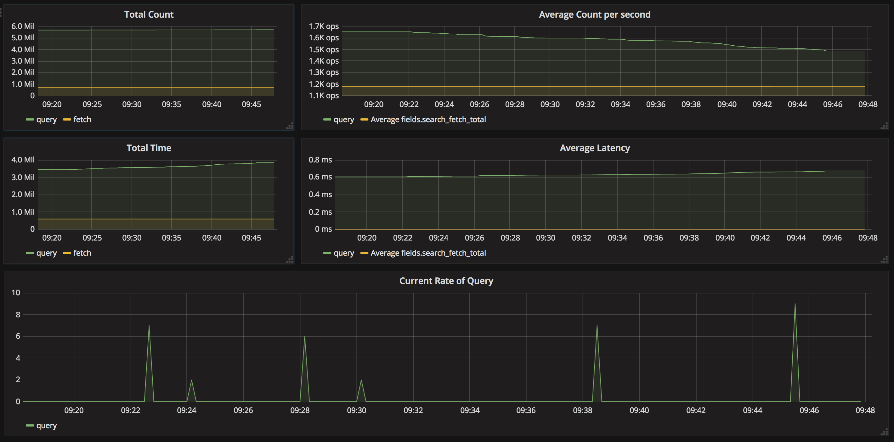
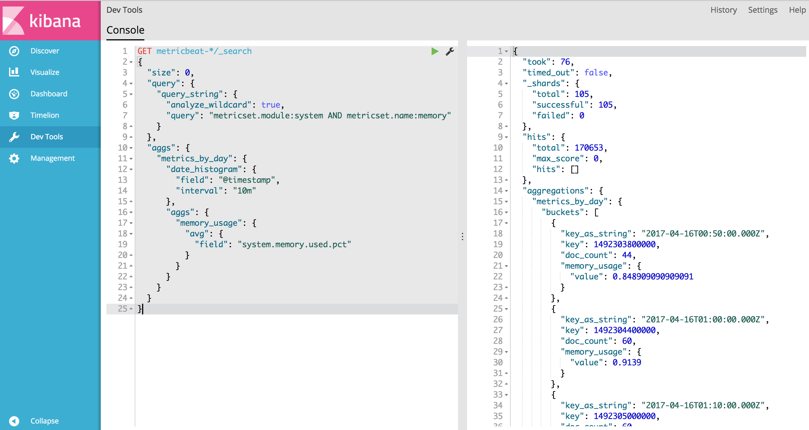
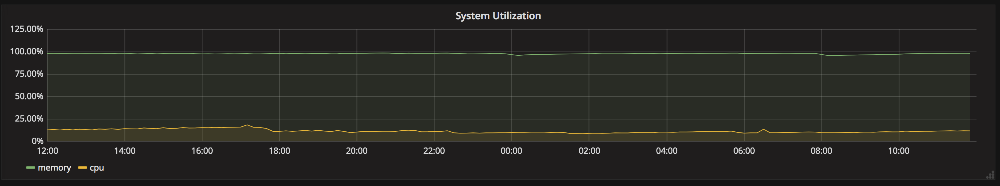
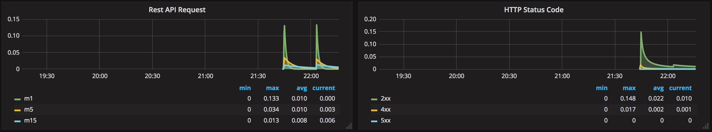

# ELK+Grafana-手把手

[課程網頁](http://eighty20.cc/apps/e2-elk-v01/index.html)

[上課錄影](https://www.youtube.com/playlist?list=PLZE8wqQYCABy9I9Qr8A_wcs2c948_rU-h)

### dashboards

課堂操作
- [session1](dashboards/ELK-session1.json)
- [session2](dashboards/ELK-session2.json)
- [session3](dashboards/ELK-session4.json)
- [session4](dashboards/ELK-session4-mine.json)

作業
- [session2](dashboards/ELK-session2-hw.json)
- [session3](dashboards/ELK-session3-hw.json)
- [session4](dashboards/ELK-session4-hw.json)

### screenshots

第二堂作業

第三堂作業一

第三堂作業二

第四堂作業

